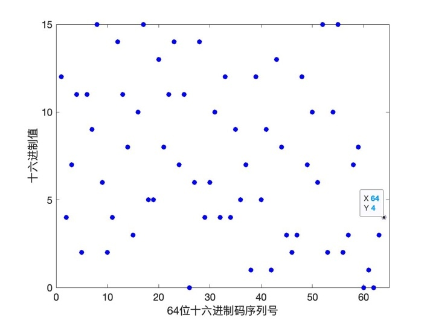
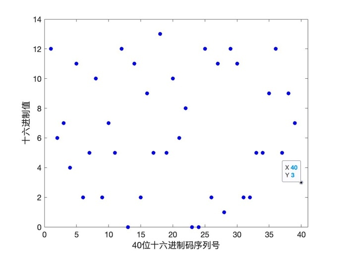
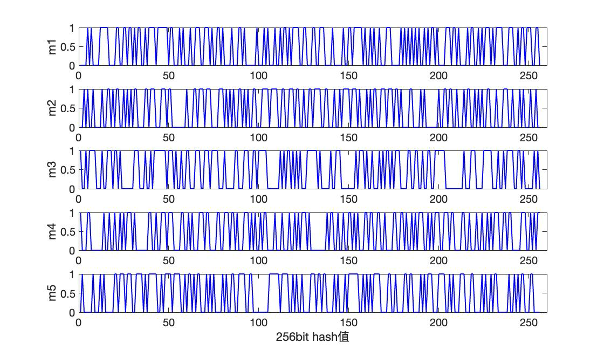
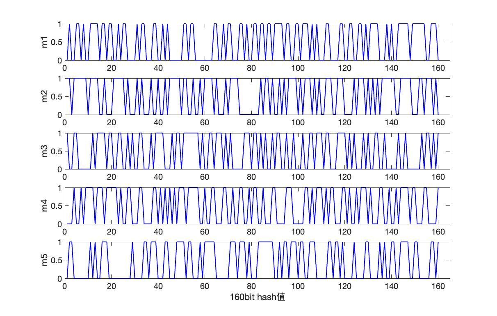
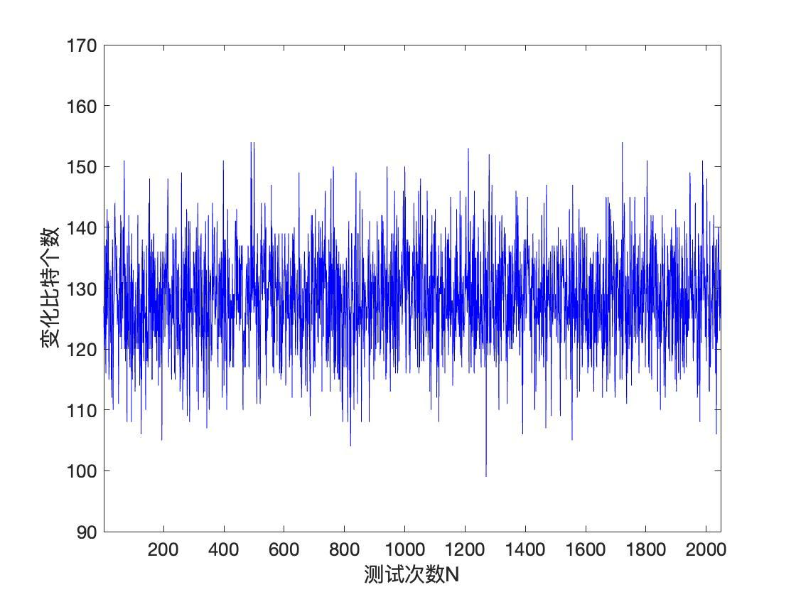
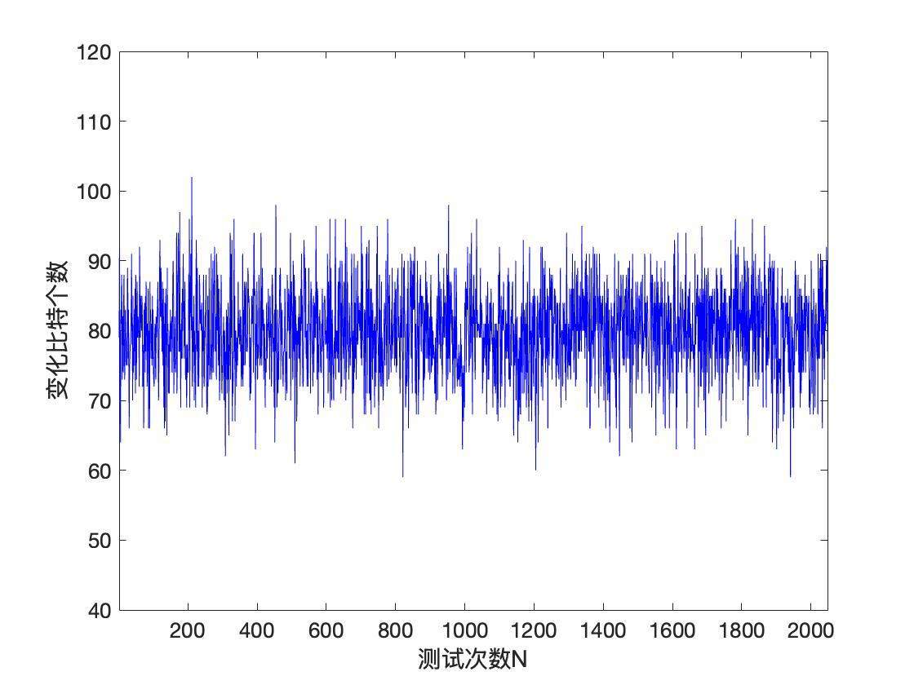
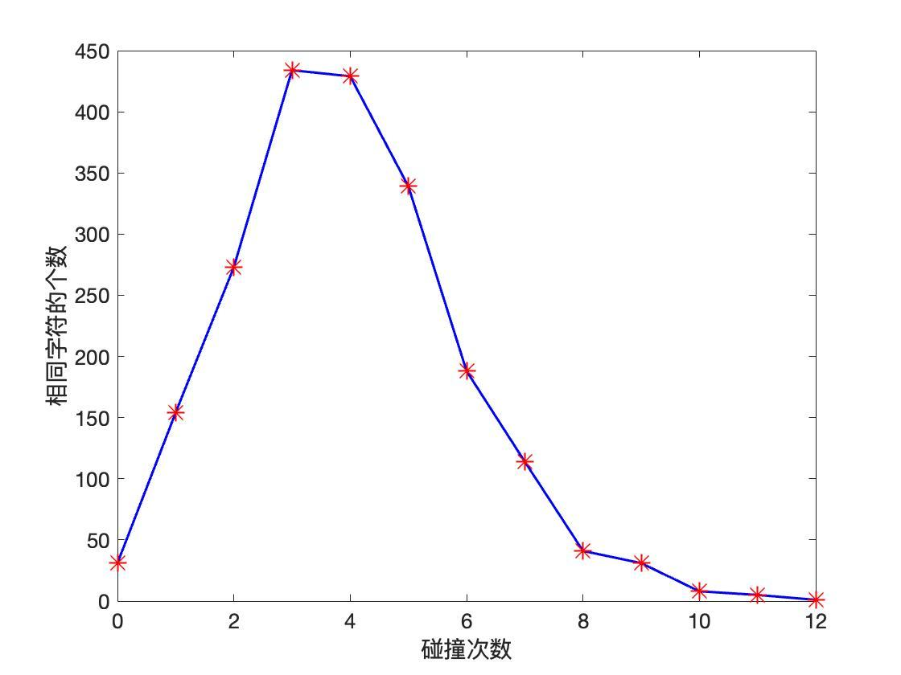
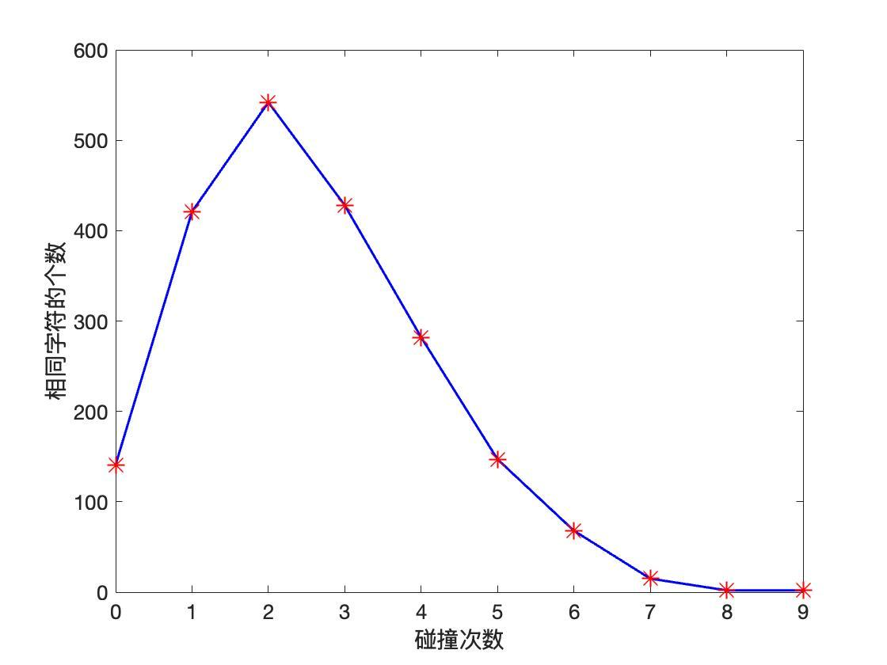
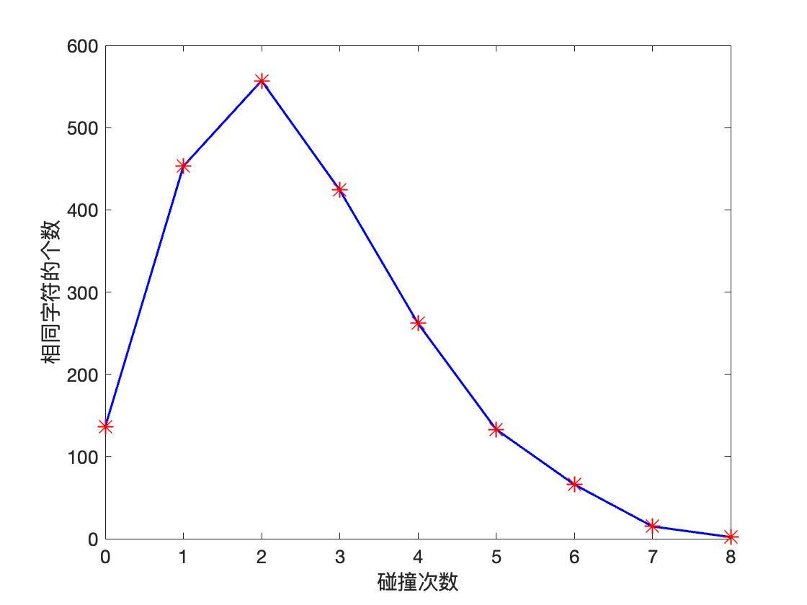

# New-RIPEMD-160: RIPEMD-160 Improvement and Security Analysis (MATLAB)

**中文 | English**

---

## 中文

本仓库包含 **New-RIPEMD-160** 改进版算法的 MATLAB 实现，以及对 RIPEMD-160 / New-RIPEMD-160 的安全性分析脚本与论文实验图表。

- `new_ripemd160/`：改进版 New-RIPEMD-160 实现（含原始 RIPEMD-160 实现作为对比）。
- `analysis/`：针对分布、敏感性、混乱扩散与抗碰撞性的分析脚本。
- `figures/`：直接从论文第五章、第六章提取的 MATLAB 实验图。

> 注意：New-RIPEMD-160 仅修改了左分支消息块 `C` 的迭代函数，因此输出与标准 RIPEMD-160 不同，目的是提升安全性。若需要标准 RIPEMD-160 的 MATLAB 实现，请见 [`RIPEMD-160-MATLAB`](https://github.com/Cissy4mA/RIPEMD-160-MATLAB)。

### 1. 改进点

论文第六章提出，在左分支主循环更新消息块 `C` 时，引入一个中间量 `S`：

```matlab
S = B + cycle_shift(T, s(j));       % 中间量
C   = cycle_shift(S, 5);            % 新的 C 更新
```

原 RIPEMD-160 的 `C` 直接继承上一轮的 `B`。New-RIPEMD-160 通过上述改动增加左分支的状态混淆，使得相同位置出现相同值的次数减少，从而增强抗碰撞能力。

### 2. 安全性分析结论与数据

测试样本为对明文进行单比特改动后统计 256 / 512 / 1024 / 2048 次实验的平均值。

#### 2.1 Hash 值分布

RIPEMD-160 加密后，Hash 值在十六进制空间均匀分散，无明显统计规律。

| | 图 |
|---|---|
| RIPEMD-160 |  |
| New-RIPEMD-160 |  |

#### 2.2 明文敏感性（雪崩效应）

对原始明文做 5 种不同微小改动后分别加密，得到的 Hash 序列差异显著，说明算法对输入高度敏感。

| | 图 |
|---|---|
| RIPEMD-160 |  |
| New-RIPEMD-160 |  |

#### 2.3 混乱与扩散性质

对消息明文改变 1 bit，统计 2048 次实验中 Hash 值变化的比特数。理想情况下，160 bit 输出的平均变化比特数 `Bn` 应接近 80，变化概率 `P` 应接近 50%。

| 测试次数 N | Bn | P (%) | ΔB | ΔP |
|---|---:|---:|---:|---:|
| 256 | 79.7818750 | 49.8242 | 6.405191 | 4.0032 |
| 512 | 80.271484 | 50.1697 | 6.681936 | 4.1762 |
| 1024 | 80.306641 | 50.1917 | 6.145015 | 3.8406 |
| 2048 | 79.827637 | 49.8923 | 6.258562 | 3.9116 |
| **平均值** | **80.046909** | **50.0194** | **6.372676** | **3.9829** |

`Bn` 与 `P` 均接近理想值，且 `ΔB`、`ΔP` 很小，说明 RIPEMD-160 具有良好的混乱与扩散能力。

| | 图 |
|---|---|
| RIPEMD-160 |  |
| New-RIPEMD-160 |  |

#### 2.4 抗碰撞性

测试方法：对同一明文随机改变 1 bit，比较两次 Hash 值在 ASCII 字符表示下相同位置相同字符出现的次数（“击中”次数）。击中次数越少，抗碰撞性越强。

| 算法 | 平均碰撞次数 | 相同位置相同值总数 | 结论 |
|---|---:|---|---|
| RIPEMD-160 | **2.538574** | 较多 | 良好 |
| New-RIPEMD-160 | **2.475098** | 明显减少 | 抗碰撞性增强 |

| | 图 |
|---|---|
| RIPEMD-160 |  |
| New-RIPEMD-160 |  |
| New-RIPEMD-160 |  |

### 3. 使用说明

1. 将 `new_ripemd160/` 与 `analysis/` 加入 MATLAB 路径：
   ```matlab
   addpath('new_ripemd160');
   addpath('analysis');
   ```
2. 运行 `new_ripemd160/new_ripemd160.m` 计算改进版 Hash。
3. 运行 `analysis/` 中的 `distribution.m`、`sensibility.m`、`mess.m`、`crash.m`、`crash_new.m` 复现安全分析。

### 4. 文件清单

```
New-RIPEMD-160/
├── new_ripemd160/          % 改进版 New-RIPEMD-160 实现
│   ├── new_ripemd160.m
│   ├── function_choose.m
│   ├── cycle_shift.m
│   ├── adjust.m
│   ├── add0.m
│   ├── add0_H.m
│   ├── plus1.m
│   ├── nega.m
│   ├── ripemd160.m         % 原始 RIPEMD-160，作为对照
│   ├── crash_new.m
│   └── ...
├── analysis/               % 安全性分析脚本
│   ├── distribution.m
│   ├── sensibility.m
│   ├── mess.m
│   ├── crash.m
│   ├── crash_new.m
│   └── ...
├── figures/                % 论文实验图
├── README.md
└── LICENSE
```

---

## English

This repository contains the MATLAB implementation of the **New-RIPEMD-160** improved hash algorithm, together with security-analysis scripts and the experimental figures from the thesis (Chapters 5 and 6).

- `new_ripemd160/`: New-RIPEMD-160 implementation (the original RIPEMD-160 implementation is also included for comparison).
- `analysis/`: Scripts for distribution, sensitivity, confusion/diffusion, and collision-resistance analysis.
- `figures/`: MATLAB figures extracted directly from Chapters 5 and 6 of the thesis.

> Note: New-RIPEMD-160 only modifies the left-branch update of message block `C`, so its output differs from standard RIPEMD-160; the goal is improved security. For the standard RIPEMD-160 MATLAB implementation, see [`RIPEMD-160-MATLAB`](https://github.com/Cissy4mA/RIPEMD-160-MATLAB).

### 1. Improvement

Chapter 6 introduces an intermediate value `S` when updating block `C` in the left branch:

```matlab
S = B + cycle_shift(T, s(j));       % intermediate value
C   = cycle_shift(S, 5);            % updated C
```

In standard RIPEMD-160, `C` simply takes the previous `B`. The extra rotation in New-RIPEMD-160 increases left-branch confusion, reduces identical-value hits at the same positions, and strengthens collision resistance.

### 2. Security analysis results and data

Statistics are averaged over 256 / 512 / 1024 / 2048 trials after flipping a single plaintext bit.

#### 2.1 Hash-value distribution

After RIPEMD-160 encryption, Hash values are uniformly scattered in hexadecimal space with no obvious statistical pattern.

| | Figure |
|---|---|
| RIPEMD-160 |  |
| New-RIPEMD-160 |  |

#### 2.2 Plaintext sensitivity (avalanche effect)

After five different minor modifications to the original plaintext, the resulting Hash sequences differ significantly, indicating high input sensitivity.

| | Figure |
|---|---|
| RIPEMD-160 |  |
| New-RIPEMD-160 |  |

#### 2.3 Confusion and diffusion

Flipping 1 bit of the plaintext, the number of changed Hash bits is recorded over 2048 trials. For an ideal 160-bit output, the average changed-bit count `Bn` should be close to 80 and the change probability `P` close to 50%.

| Trials N | Bn | P (%) | ΔB | ΔP |
|---|---:|---:|---:|---:|
| 256 | 79.7818750 | 49.8242 | 6.405191 | 4.0032 |
| 512 | 80.271484 | 50.1697 | 6.681936 | 4.1762 |
| 1024 | 80.306641 | 50.1917 | 6.145015 | 3.8406 |
| 2048 | 79.827637 | 49.8923 | 6.258562 | 3.9116 |
| **Average** | **80.046909** | **50.0194** | **6.372676** | **3.9829** |

`Bn` and `P` are close to the ideal values, and `ΔB`, `ΔP` are small, showing good confusion and diffusion.

| | Figure |
|---|---|
| RIPEMD-160 |  |
| New-RIPEMD-160 |  |

#### 2.4 Collision resistance

Test method: randomly flip 1 bit of the same plaintext, then compare the two Hash values in ASCII form and count identical characters at identical positions ("hits"). Fewer hits means stronger collision resistance.

| Algorithm | Average collision count | Total same-position identical values | Conclusion |
|---|---:|---|---|
| RIPEMD-160 | **2.538574** | relatively high | good |
| New-RIPEMD-160 | **2.475098** | significantly reduced | improved |

| | Figure |
|---|---|
| RIPEMD-160 |  |
| New-RIPEMD-160 |  |
| New-RIPEMD-160 |  |

### 3. Usage

1. Add `new_ripemd160/` and `analysis/` to the MATLAB path:
   ```matlab
   addpath('new_ripemd160');
   addpath('analysis');
   ```
2. Run `new_ripemd160/new_ripemd160.m` to compute the improved Hash.
3. Run `distribution.m`, `sensibility.m`, `mess.m`, `crash.m`, and `crash_new.m` in `analysis/` to reproduce the security analysis.

### 4. File tree

```
New-RIPEMD-160/
├── new_ripemd160/          % New-RIPEMD-160 implementation
│   ├── new_ripemd160.m
│   ├── function_choose.m
│   ├── cycle_shift.m
│   ├── adjust.m
│   ├── add0.m
│   ├── add0_H.m
│   ├── plus1.m
│   ├── nega.m
│   ├── ripemd160.m         % original RIPEMD-160 for comparison
│   ├── crash_new.m
│   └── ...
├── analysis/               % security analysis scripts
│   ├── distribution.m
│   ├── sensibility.m
│   ├── mess.m
│   ├── crash.m
│   ├── crash_new.m
│   └── ...
├── figures/                % thesis figures
├── README.md
└── LICENSE
```
